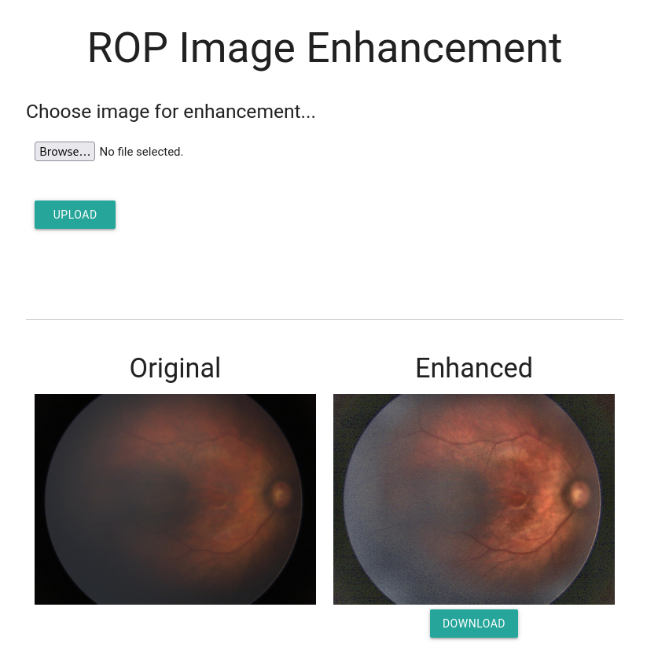

# Retinal Image Enhancement Using Deep Learning
## Purpose
This work is built for enhancement of Retinopathy of Prematurity (ROP) images. The images taken in this field are of low quality due to limitations of retinal imagery in prematurity. Observing the retina for its abnormal surfaces and vascular appearances is important for retinopathy diagnosis.  

## Mechanism
This project utilizes a deep learning model to configure the filters and parameters needed for enhancing the image. It first calculates some metrics (mode intensity, frequency average, standard deviation, ...) based on pixel values, then these values are given to a shallow neural net (simple 2 layers 150 neurons for example). The output of the network is brightness, contrast, denoise, ... values that are then used to edit the image.

## Features & Scripts
### Web GUI
* web.py  
This is script runs a flask based web GUI for the model.
It uses ONNX model file, no need to install torch for this, it is lightweight and simple.

## CLI Inference
* infer_from_onnx.py  
You can use this script to directly try out the model on the command line. It receives ONNX and JPG, outputs the enhanced image.

## Training
* **model.py**  
This file is for training the model and outputing the ONNX. I have included the onnx for demo so no need to train if you just want to try it out.  
The script expects a COCO style JSON of the resulting brightness, contrast, etc values (included my JSON as example) and a pickle object generated by calculate_statistics_for_all_images.py containing the mentioned statistics of pixels (frequency, mode, ...).

* **calculate_statistics.py**
Contains function for calculating statistics of image pixels. The function is used by calculate_statistics_for_all_images.py. to generate pickle object for model.

* **calculate_statistics_for_all_images.py**  
The name is self-explanatory. My images were in 'original_gt/low' directory. 'original_gt/high' directory contains the images after manual enhancement as ground truth. However, only the brightness, contrast, etc values were used. The images themselves are not given to the neural net model.

* model_output.json  
This JSON is generated using [jupyter_image_editor](https://github.com/monajemi-arman/jupyter_image_editor). The mentioned project jupyter notebook lets you edit the images with the necessary parameters required by the model and generate the JSON.

## Usage
First clone this repository.
```
git clone https://github.com/monajemi-arman/rop_enhance_neural_net
```
To use the web gui for inference and image enhancement just run web.py:
```
python web.py
```
Now go to: [http://127.0.0.1:33517](http://127.0.0.1:33517)
 
## Demo

